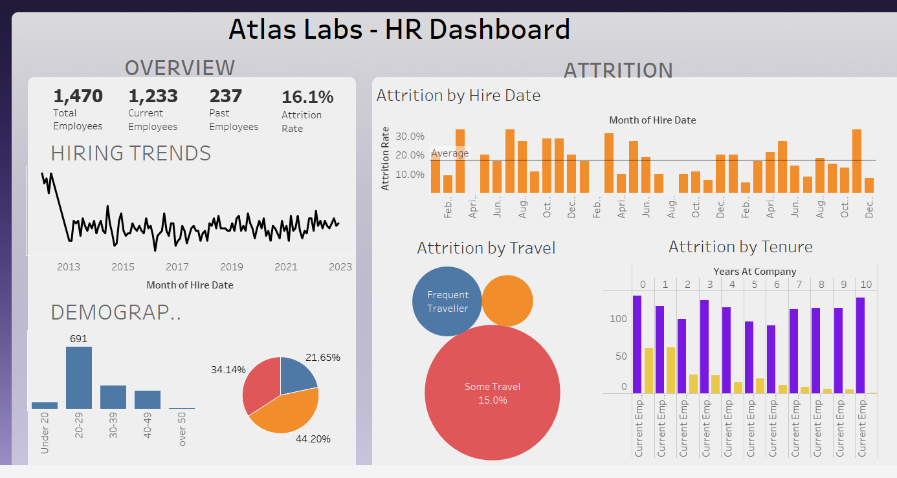

# 👩‍💼 Atlas Labs – HR Analytics Dashboard (Tableau)

📊 **[Click here to interact with the live visualization](https://public.tableau.com/views/HRAnalytics_17227485232780/HRDashboard?:language=en-US&:sid=&:redirect=auth&:display_count=n&:origin=viz_share_link)**

## 📌 Project Overview

This project focuses on **HR Analytics** using Tableau. The dashboard provides actionable insights into employee **attrition, hiring trends, and workforce demographics** to support strategic decision-making.

## 🎯 Objectives

* Track **overall employee count, attrition rate, and workforce distribution**.
* Identify **hiring trends over time**.
* Analyze **attrition patterns** by hire date, travel frequency, and tenure.
* Provide demographic insights (age distribution).
* Support HR teams with **data-driven decisions**.

## 🛠️ Tools & Technologies

* **Tableau** – for interactive dashboards & data visualization
* **HR Employee Dataset** – (employee demographics, attrition, hiring history, travel, tenure)

## 📊 Dashboard Features

1. **Overview Metrics**

   * Total employees: **1,470**
   * Current employees: **1,233**
   * Past employees: **237**
   * Attrition rate: **16.1%**

2. **Hiring Trends**

   * Timeline showing employee hiring patterns from **2013 to 2023**.

3. **Attrition Analysis**

   * **By Hire Date** – Monthly attrition rates vs. average.
   * **By Travel** – Travel frequency impact on attrition.
   * **By Tenure** – Attrition across years at the company.

4. **Demographics**

   * Age distribution of employees (dominant group: **20–29 years**).
   * Gender and other breakdowns included in the dataset.

## ✅ Insights

* The **20–29 age group** forms the majority of the workforce.
* Employees with **frequent or some travel** show higher attrition rates.
* **Attrition spikes** during certain hiring months (e.g., June, December).
* Early tenure (0–2 years) shows **higher attrition**, suggesting onboarding/retention challenges.

## 📂 Dataset Source

* HR Employee dataset
